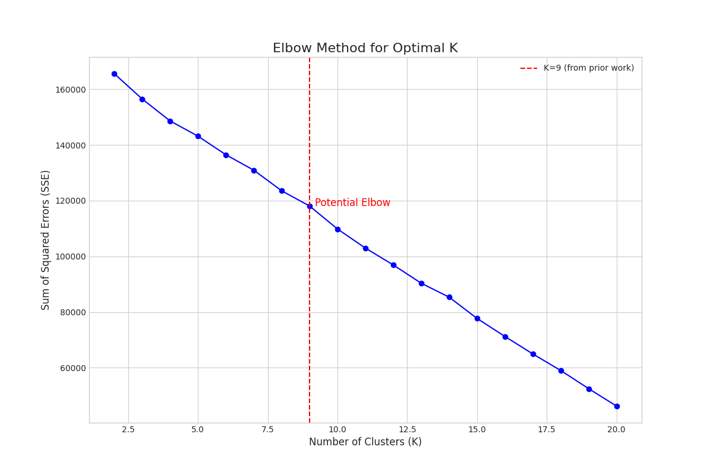
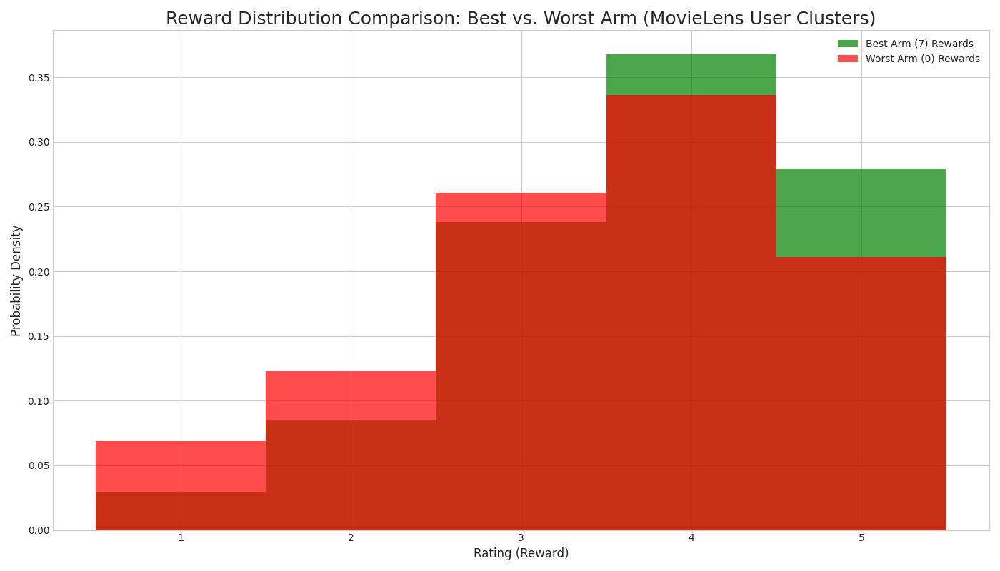
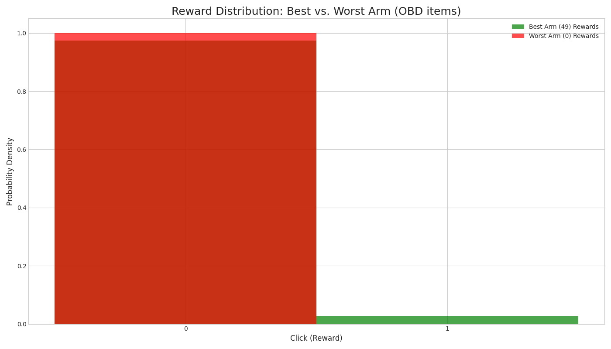
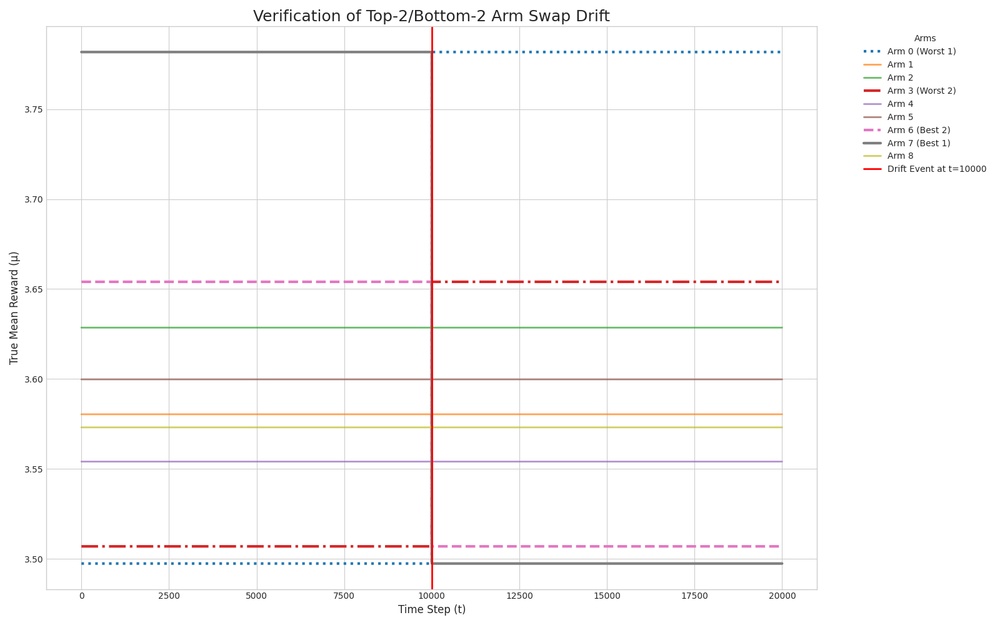
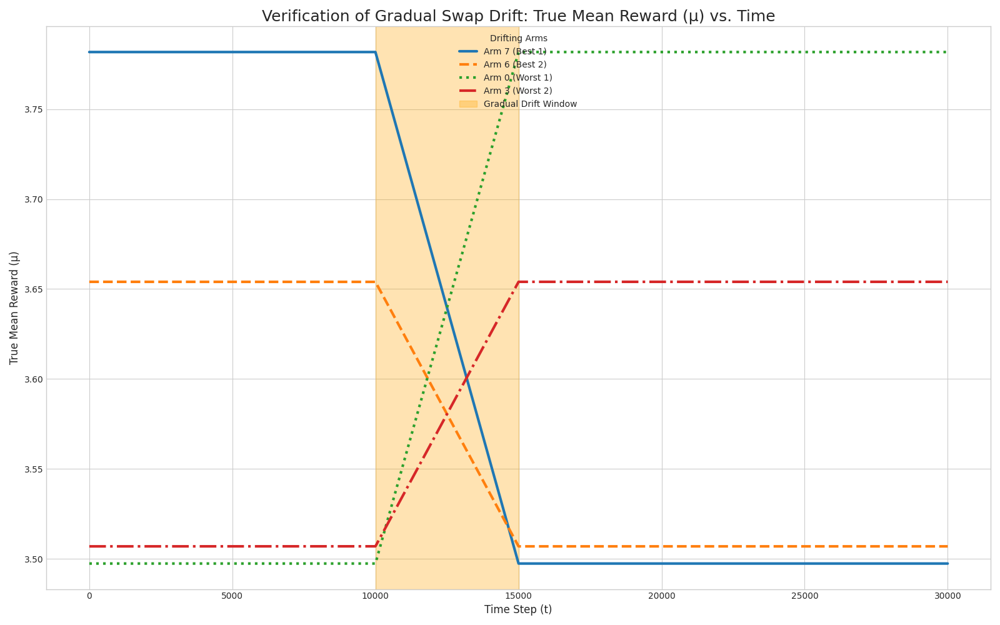

# UCB 算法的数据驱动模拟实验平台 (V2)

## 1. 背景与动机

本项目旨在对原有的 `f-dsw` 实验平台进行根本性重构。我们摒弃了局限性较多的**离线回放评估 (Offline Replay Evaluation)** 框架，升级为一个功能完善、理论严谨的**基于真实数据的半合成模拟（Data-Driven Semi-Synthetic Simulation）**框架。

本次重构的核心目的是为了能够在一个可控、可复现的环境中，精确计算算法在每一轮的**期望遗憾 (Expected Regret)**，即 `µ* - µ_A(t)`。这使我们能够对 UCB 系列算法在非平稳环境下的性能做出最标准、最无可争议的评估，为最终的学术论文提供坚实的方法论基础。

## 2. 方法论: 数据驱动的环境构建

我们为两个经典数据集 MovieLens-1M 和 Open Bandit Dataset (OBD) 分别设计了数据驱动的模拟环境。

### 2.1. MovieLens-1M 环境

我们采用用户聚类的方式来定义“臂”，以模拟向不同用户画像进行推荐的场景。

1.  **定义“臂” (Arms) - K=9 的用户画像**:
    *   我们加载 `users.dat` 数据，并对用户的核心人口统计学特征（`Age`, `Gender`, `Occupation`）进行独热编码和标准化。
    *   为了科学地选择“臂”的数量 `K`，我们采用**手肘法 (Elbow Method)** 对聚类效果进行评估。如下图所示，当 K=9 时，SSE (误差平方和) 曲线的下降速率开始趋于平缓，是模型复杂度和解释力之间的一个理想平衡点。因此，我们确定使用 `K=9`。
        *   *决策依据可由 `notebooks/find_optimal_k.py` 脚本复现。*
    *   

2.  **定义“奖励” (Rewards) - 真实评分池**:
    *   我们为9个“臂”（用户簇）分别创建一个“奖励池”，其中包含所有属于该簇的用户给出的全部真实电影评分（1-5星）。
    *   下图清晰地展示了初始最优臂和最差臂在奖励分布上的根本性差异，验证了我们“臂”定义的有效性。
    *   

3.  **提供“上帝视角” (`µ`值)**:
    *   在模拟开始前，我们预先计算每个臂的奖励池中所有评分的**真实平均值 `µ_a`**，并将最大值定义为 `µ*`。
    *   *核心实现位于 `data/movielens_sim_handler.py`*

### 2.2. Open Bandit Dataset (OBD) 环境

由于OBD没有丰富的用户特征，我们采用更直接的方式，以物品ID作为“臂”。

1.  **定义“臂” (Arms) - 80个物品ID**:
    *   我们加载 `obd/random/all.csv` 数据。
    *   数据集中的 **80个** 独特 `item_id` 被直接定义为我们的80个“臂”。

2.  **定义“奖励” (Rewards) - 真实点击池**:
    *   我们为80个“臂”（`item_id`）分别创建一个“奖励池”，其中包含该物品所有的历史交互记录所对应的 `click` 值 (0或1)。
    *   下图展示了最优臂（CTR≈2.6%）和最差臂（CTR=0%）的奖励分布，反映了真实推荐场景中奖励的高度稀疏性。
    *   

3.  **提供“上帝视角” (`µ`值)**:
    *   同理，我们预先计算每个物品臂的奖励池中所有点击的**真实平均CTR `µ_a`**，并确定 `µ*`。
    *   *核心实现位于 `data/obd_sim_handler.py`*

## 3. 实验设计与评估

### 3.1. 核心模拟参数
*   **Horizon (N)**: 实验总轮数 `N`，可自由设定。

### 3.2. 非平稳性注入 (Drift Injection)
我们设计了确定性的、可复现的漂移机制。所有漂移参数通过 `config.yaml` 文件进行配置。

*   **突变 (Abrupt Drift)**: 通过 `drift_swap_extremes()` 方法实现，交换Top-2和Bottom-2臂。
    *   **MovieLens 验证图**:
        
*   **渐变 (Gradual Drift)**: 通过 `init_gradual_drift()` 方法实现，线性平滑地交换Top-2和Bottom-2臂的`µ`值。
    *   **MovieLens 验证图**:
        

### 3.3. 评估指标与可视化规划
*   **核心指标**: **累积期望遗憾 (Cumulative Expected Regret)**, `Regret_t = µ* - µ_{A_t}`。
*   **核心可视化**: 累积遗憾对比图、算法滚动平均奖励图、最终性能总结表。

### 3.4. 核心算法实现
本项目在经典的 UCB 算法基础上，实现了多种适应非平稳环境的变体：
*   **UCB1**: 标准的 UCB 算法，作为性能基准。
*   **UCB_D (Discounted UCB)**: 对历史奖励的统计数据（成功/失败次数）进行折扣衰减，使得近期的奖励比重更大。
*   **UCB_SW (Sliding-Window UCB)**: 只使用一个固定大小的时间窗口内的奖励信息进行决策，每个臂维护自己独立的窗口。
*   **FDSW_UCB (f-Discounted Sliding Window UCB)**: 我们根据 Cavenaghi et al. (2021) [1] 的思想实现的核心算法。它为每个臂同时维护两套估值体系：
    1.  **历史轨迹**: 使用折扣因子 `gamma` 考虑所有历史观测。
    2.  **热门轨迹**: 使用一个大小为 `window_size` 的滑动窗口仅考虑近期观测。
    在决策时，通过一个**聚合函数 (`agg_function`)** 将两个体系计算出的 UCB 值进行组合。我们实现了三种变体：`min` (悲观), `max` (乐观), `mean` (平均)。

## 4. 核心算法库

我们的实验平台实现并验证了以下 MAB 算法：

*   **`UCB1`**: 经典的、无遗忘机制的 UCB 算法，作为性能基准。
*   **`ThompsonSampling`**: 基于Beta-Bernoulli分布的汤普森抽样，作为另一个关键基准。
*   **`UCB_D` (Discounted UCB)**: 为每个臂的奖励和观测次数引入一个折扣因子 `gamma`。时间越久远的观测，其权重呈指数级衰减。
*   **`UCB_SW` (Sliding-Window UCB)**: 只考虑每个臂最近 `window_size` 次的观测数据来计算其价值，完全抛弃窗口外的数据。
*   **`UCB_FDSW` (f-Discounted-Sliding-Window UCB)**: 我们根据 Cavenaghi et al. (2021) [1] 的思想实现的核心算法。它为每个臂同时维护两套估值体系：
    1.  **历史轨迹**: 使用折扣因子 `gamma` 考虑所有历史观测。
    2.  **热门轨迹**: 使用一个大小为 `window_size` 的滑动窗口仅考虑近期观测。
    在决策时，通过一个**聚合函数 (`agg_function`)** 将两个体系计算出的 UCB 值进行组合。我们实现了三种变体：`min` (悲观), `max` (乐观), `mean` (平均)。

#### 动态窗口大小计算

对于 `UCB_SW` 和 `FDSW_UCB` 算法，其核心参数 `window_size` (窗口大小) 可以被动态计算，无需在配置文件中手动指定。我们采纳了 `SMPyBandits` 库中提出的启发式思想，如果 `params` 中未提供 `window_size`，程序将根据以下公式自动计算：

\[ \tau = C \cdot \sqrt{\frac{T \cdot \log(T)}{L}} \]

其中:
- \( \tau \): 计算出的窗口大小。
- \( T \): 实验的总轮数 (`horizon`)。
- \( L \): 在 `drift_config` 中定义的漂移事件总数 (若无漂移则默认为 1)。
- \( C \): 一个探索常数，在我们的实现中硬编码为 **2**。

这一自动化机制使得算法能更好地根据实验的长度和非平稳性程度，自适应地调整其“记忆”长度。

### 3. 环境配置

实验环境通过位于 `config/` 目录下的 YAML 文件进行配置。这些文件定义了从数据集、实验长度到所用算法及其超参数的所有内容。

**`obd_abrupt.yaml` 示例:**

## 5. 如何运行实验与评估

我们已经创建了6个预设的实验配置文件，位于 `config/` 目录下，涵盖了两个数据集和三种环境（平稳、突变、渐变）。

### 5.1. 运行单个实验
使用 `main.py` 脚本并指定一个配置文件来运行实验。脚本会自动使用所有CPU核心进行并行化。

**示例:** 运行 MovieLens 突变场景实验
```bash
python ucb_simulation_platform/main.py --config ucb_simulation_platform/config/movielens_abrupt.yaml
```
实验结果 (每个算法、每次运行的详细日志) 将会保存在 `results/` 目录下。

### 5.2. 评估实验结果
实验完成后，使用 `evaluate.py` 脚本并指定**相同的配置文件**来生成图表和总结。

**示例:** 评估 MovieLens 突变场景的实验结果
```bash
python ucb_simulation_platform/evaluate.py --config ucb_simulation_platform/config/movielens_abrupt.yaml
```
脚本会生成两张图（累积遗憾图、滚动奖励图）保存在 `figures/` 目录下，并在终端打印出最终性能的Markdown表格。

## 6. 附录：验证脚本参数
| 脚本文件 | HORIZON | DRIFT_POINT / START | DURATION | N_CLUSTERS |
| :--- | :--- | :--- | :--- | :--- |
| `verify_drift.py` | 20000 | 10000 | N/A | 9 |
| `verify_gradual_drift.py`| 30000 | 10000 | 5000 | 9 |
| `verify_obd_drift.py` | 5000 | 2500 | N/A | N/A |
| `verify_obd_gradual_drift.py`| 5000 | 2000 | 1000 | N/A |

## 7. 重构路线图与致谢
1.  **[已完成]** 确定 K=9 作为 MovieLens 用户聚类的臂数。
2.  **[已完成]** 创建并测试 `MovieLensSimHandler` 和 `OBDSimHandler`。
3.  **[已完成]** 创建 `NonStationaryEnvironment` 并验证其所有漂移机制。
4.  **[已完成]** 修正环境的奖励机制，从返回确定性均值改为随机抽样。
5.  **[已完成]** 深入分析论文及原作者代码，修正并完整实现 `UCB_D`, `UCB_SW` 及 `FDSW_UCB` 算法。
6.  **[已完成]** 更新所有实验配置文件以使用新的算法库和参数。
7.  **[下一步]** 运行所有6个实验，分析结果，撰写论文。

特别感谢我们的合作研究者，您敏锐的洞察力和对严谨性的不懈追求，是推动本项目达到更高科学标准的核心动力。

**引用**:
[1] Cavenaghi, E.; Sottocornola, G.; Stella, F.; Zanker, M. Non Stationary Multi-Armed Bandit: Empirical Evaluation of a New Concept Drift-Aware Algorithm. Entropy 2021, 23, 380. https://doi.org/10.3390/e23030380 


max (乐观策略):
决策方式: 最终分数 = max(ucb_d, ucb_sw)
行为解读: 只要一个臂在“历史”或“近期”任何一个视角下看起来不错，它就会被赋予一个很高的分数。这是一种非常激进和乐观的策略。
适用场景: 非常适合需要快速响应的环境。当一个漂移发生，一个曾经的好臂变差，ucb_sw 会迅速降低，但 ucb_d 降低较慢。反之，一个新变好的臂，ucb_sw 会迅速升高，max 策略能让算法立即注意到这个机会并开始利用。
min (悲观策略):
决策方式: 最终分数 = min(ucb_d, ucb_sw)
行为解读: 一个臂必须同时在“历史”和“近期”两个视角下都表现优异，才能获得高分。这是一种非常保守和悲观的策略。
适用场景: 适合奖励变化方差很大、噪声很高的环境。它可以有效避免算法被短暂的、偶然的高奖励“欺骗”，只有在确认一个臂持续稳定地好时，才会去选择它。
mean (平衡策略):
决策方式: 最终分数 = (ucb_d + ucb_sw) / 2
行为解读: 它对两个视角给出的分数进行了中和与平衡。
适用场景: 这是一个稳健的默认选项，它既不像 max 那样对机会过于敏感，也不像 min 那样对风险过于规避。